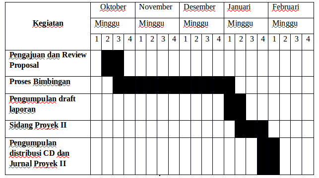

<h2 align="center">BAB I   PENDAHULUAN</h2>
<strong>1.1 Latar Belakang</strong>

Di era global kebutuhan manusia akan system keamanan lingkungan sangat di butuhkan dan erat kaitannya dengan penerapan teknologi. Salah satu contohnya adalah penerapan teknologi ke dalam aplikasi-aplikasi web yang terhubung dengan mikrocontroller di berbagai kota modern. Penerapan teknologi yang dimaksud salah satunya adalah sistem yang bisa memantau lewat jarak jauh menggunakan web aplikasi yang terintegrasi dengan mikrocontoller.

Banyak nya produk makanan yang menggunakan bahan-bahan yang bisa memicu bau tidak sedap dengan skala besar. Bau tersebut berasal dari kandungan gas ammonia (NH3) yang tinggi dan gas hydrogen sulfide (H2S), ammonia adalah gas tidak berwarna yang mempunya daya iritasi yang tinggi terutama terhadap mata dan pernapasan manusia, bau tersebut berasal dari tempat sampah yang disebabkan adanya penumpukan sampah.

Pada proyek ini, penulis akan merancang <i>“RANCANG BANGUN SISTEM PENDETEKSI BAU SAMPAH BERBASIS IOT”</i>. Dalam perancangannnya sistem ini menggunakan website sebagai wadah penerima data yang di kirim dari microcontroller yang sudah terintegrasi, data yang dikirim berupa informasi kadar bau ammonia pada tempat sampah, karena telah disebutkan bahwa gas amonia ditimbulkan dari sampah yang menumpuk dan juga memberi informasi untuk lingkungan yang berada di sekitar tempat sampah akan bahayanya gas ammonia berupa notifikasi.

Diharapkan dengan adanya teknologi tersebut bisa menjadi salah satu langkah hidup sehat pada era modern ini.

 
<strong>1.2 Identifikasi Masalah</strong>

Berdasarkan latar belakang tersebut dapat di identifikasi bahwa permasalahan yang ada adalah:
 
1. Pengelolaan sampah yang belum efektif yang menimbulkan pencemaran lingkungan.
 
2. Belum adanya indicator gas ammonia pada tempat sampah.
 
 
<strong>1.3 Tujuan dan Manfaat</strong>
 
 
<strong>1.3.1 Tujuan</strong>

Berdasarkan uraian latar belakang masalah, maka tujuan penyusunan proposal Proyek II yang berjudul <i>“RANCANG BANGUN SISTEM PENDETEKSI BAU SAMPAH BERBASIS IOT”</i>  ini adalah:
 
1. Pengelolaan sampah yang efektif dan aman unutk lingkungan sekitar.
 
2. Dapat memantau kadar gas ammonia di tempat sampah 
 
 
<strong>1.3.2 Manfaat</strong>

Manfaat dari penyusunan proposal ini adalah sebagai berikut:
 
1. Menjaga lingkungan agar tetap asri dan bebas dari polusi gas berbahaya.
 
2. Memanajemen perawatan dari sampah tersebut.
 
<strong>1.4 Ruang Lingkup</strong>

Dalam penyusunan proposal proyek II, penulis membatasi pembahasan hanya pada:
 
1. Analisis sistem hanya meliputi: 
 
&nbsp;&nbsp;&nbsp;&nbsp;&nbsp;a. Memberikan data indicator bau.
 
&nbsp;&nbsp;&nbsp;&nbsp;&nbsp;b. Menerima data indicator bau dari prototype. 
 
&nbsp;&nbsp;&nbsp;&nbsp;&nbsp;c. Memberikan informasi kepada petugas administrasi jika kadar bau gas (ammonia) pada sampah sudah melebihi batas.
 
2. Sasaran dari alat ini yaitu untuk membaca berbagai kondisi tempat sampah
 
3. Perancangan pendeteksi bau yang dapat mendeteksi kadar gas ammonia dengan system administrasi pengelola pendeteksi bau.
 
4. Perilaku dan sitem hanya dapat memberikan informasi kualitas udara dengan penampilan, dan indikator.

 
<strong>1.5 Jadwal Kegiatan Pengerjaan Proyek</strong>

    
     
    Tabel 1.1 Jadwal Kegiatan Pengerjaan Proyek

