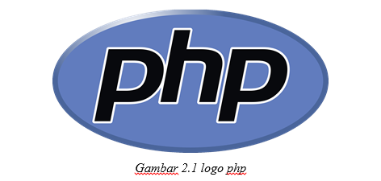
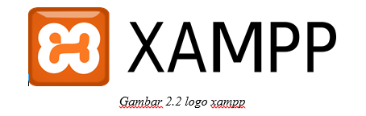
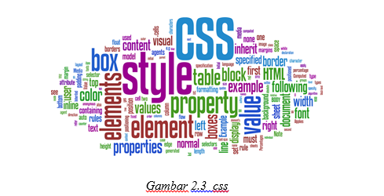
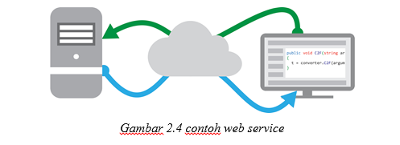
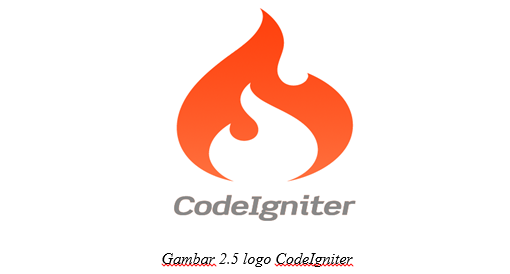

<h2 align="center">BAB II    LANDASAN TEORI </h2>
<strong>2.1 Kajian Pustaka</strong>
 
2.1.1  Perangkat Lunak
 

Perangkat lunak adalah istilah umum untuk data yang diformat dan disimpan secara digital, termasuk program komputer, dokumentasinya, dan berbagai informasi yang bisa dibaca dan ditulis oleh komputer. Dengan kata lain, bagian sistem komputer yang tidak berwujud. Istilah ini menonjolkan perbedaan dengan perangkat keras komputer (Kamus Besar Bahasa Indonesia).
Perangkat lunak ini dibagi menjadi tiga golongan, yaitu:
 
1.	Sistem Operasi
 

Software sistem operasi merupakan suatu software komplek yg mempunyai banyak fungsi yaitu untuk mengatur semua perangkat keras komputer yang terhubung dengan CPU, menerjemahkan segala aktivitas pemakai kepada CPU agar segala yang diperintahkan oleh pemakai dapat dikerjakan oleh CPU, mengatur semua proses yg terjadi di dalam CPU. Sistem operasi juga berfungsi sebagai tempat atau platform untuk menjalan suatu software aplikasi. Contoh program berbasis windows hanya dapat dijalankan di pada sistem operasi windows tidak dapat dijalankan di linux kecuali menggunakan program converter.
Saat ini sudah terdapat berbagai jenis software sistem operasi yg dapat di gunakan seperti dari perusahaan yg paling terkenal sebagai pembuat sistem operasi yaitu “Microsoft” yg dimiliki oleh orang terkaya didunia “Bill Gates” dan beberapa produk yg sudah diluncurkan di antaranya adalah Microsoft Windows (Windows 98, Windows 2000, Windows XP, dan Windows Vista, Windows 7 dan Windows 8) sedangkan pesaingnya  ada dari Linux (Mandrake, Ubuntu, dan Redhat) dan juga dari Apple.
 
2. Bahasa Pemrograman
 

SBahasa pemrograman (programming language) adalah bahasa yg digunakan untuk membuat program itu sendiri. Ada banyak bahasa pemrograman contohnya Bahasa C, C++, Visual Basic, Pascal, Borland, HTML, PHP, JAVA, dan masih banyak lagi. Untuk menunjang pembuatan harus menggunakan perangkat lunak yang digunakan untuk merancang atau membuat program sesuai dengan struktur dan metode yang dimiliki oleh bahasa program itu sendiri.
 
1.	3. Program Aplikasi
 

Program aplikasi merupakan software yang mempunyai fungsi khusus sesuai dengan tujuan pembuatannya. Program aplikasi merupakan software yang banyak digunakan untuk membantu menyelesaikan tugas tertentu, seperti untuk membuat surat, mendengarkan musik, menonton film, menghitung sejumlah angka, dan masih banyak lagi. Contoh program aplikasi seperti Microsoft word, excel, power point, Winamp, Media player classic, calculator, dll.
 
2.1.1  Perangkat Lunak
 

Web adalah suatu program yang ditemukan oleh Tim Berners-Lee pada tahun 1991. Awalnya Berners-Lee hanya ingin menemukan cara untuk menyusun arsip-arsip risetnya. Untuk itu, dia mengembangkan suatu sistem untuk keperluan pribadi. Sistem itu adalah program peranti lunak yang diberi nama Equire Dengan program itu, Berners-Lee berhasil menciptakan jaringan terkait antara berbagai arsip sehingga memudahkan informasi yang dibutuhkan. Inilah yang kemudian menjadi dasar dari sebuah revolusi yang dikenal sebagai web. Web dikembangkan pertama kali di Pusat Penelitian Fisika Partikel Eropa (CERN), Jenewa, Swiss. Pada tahun 1989 Berners-lee membuat proposal untuk proyek pembuatan hypertext secara global, kemudian pada bulan Oktober 1990, 'World Wide Web' sudah bisa dijalankan dalam lingkungan CERN. Pada musim panas tahun 1991, Web resmi digunakan secara luas pada jaringan Internet.
 
2.1.3	PHP
 

    
     
    <i>Gambar 2.1 logo php</i>

PHP: Hypertext Preprocessor adalah bahasa skrip yang dapat ditanamkan atau disisipkan ke dalam HTML. PHP banyak dipakai untuk memrogram situs web dinamis. PHP dapat digunakan untuk membangun sebuah CMS. Pada awalnya PHP merupakan kependekan dari Personal Home Page (Situs personal). PHP pertama kali dibuat oleh Rasmus Lerdorf pada tahun 1995. Pada waktu itu PHP masih bernama Form Interpreted (FI), yang wujudnya berupa sekumpulan skrip yang digunakan untuk mengolah data formulir dari web. /

 
2.1.4	XAMPP
 

    
     
    <i>Gambar 2.1 logo xampp</i>

XAMPP adalah perangkat lunak bebas, yang mendukung banyak sistem operasi, merupakan kompilasi dari beberapa program.
Fungsinya adalah sebagai server yang berdiri sendiri (localhost), yang terdiri atas program Apache HTTP Server, MySQL database, dan penerjemah bahasa yang ditulis dengan bahasa pemrograman PHP dan Perl. Nama XAMPP merupakan singkatan dari X (empat system operasi apapun), Apache, MySQL, PHP dan Perl.

 
2.1.5	CSS
 

    
     
    <i>Gambar 2.1 logo css</i>

Cascading Style Sheet (CSS) merupakan aturan untuk mengendalikan beberapa komponen dalam sebuah web sehingga akan lebih terstruktur dan seragam. CSS bukan merupakan bahasa pemograman.

Sama halnya styles dalam aplikasi pengolahan kata seperti Microsoft Word yang dapat mengatur beberapa style, misalnya heading, subbab, bodytext, footer, images, dan style lainnya untuk dapat digunakan bersama-sama dalam beberapa berkas (file). Pada umumnya CSS dipakai untuk memformat tampilan halaman web yang dibuat dengan bahasa HTML dan XHTML. 

CSS dapat mengendalikan ukuran gambar, warna bagian tubuh pada teks, warna tabel, ukuran border, warna border, warna hyperlink, warna mouse over, spasi antar paragraf, spasi antar teks, margin kiri, kanan, atas, bawah, dan parameter lainnya. CSS adalah bahasa style sheet yang digunakan untuk mengatur tampilan dokumen. Dengan adanya CSS memungkinkan kita untuk menampilkan halaman yang sama dengan format yang berbeda. 

 
2.1.6	WEB SERVICE
 

    
     
    <i>Gambar 2.1 contoh web service</i>

Web service adalah aplikasi sekumpulan data (database), perangkat lunak (software) atau bagian dari perangkat lunak yang dapat diakses secara remote oleh berbagai piranti dengan sebuah perantara tertentu.  Secara umum,web service  dapat diidentifikasikan dengan menggunakan URL seperti hanya web pada umumnya. Namun yang membedakan web service dengan web pada umumnya adalah interaksi yang diberikan oleh web service. Berbeda dengan URL web pada umumnya, URL web service hanya menggandung kumpulan informasi, perintah, konfigurasi atau sintaks yang berguna membangun sebuah fungsi-fungsi tertentu dari aplikasi.

Web service dapat diartikan juga sebuah metode pertukaran data, tanpa memperhatikan dimana sebuahdatabase ditanamkan, dibuat dalam bahasa apa sebuah aplikasi yang mengkonsumsi data, dan di platform apa sebuah data itu dikonsumsi. Web service mampu menunjang interoperabilitas. Sehingga web service mampu menjadi sebuah jembatan penghubung antara berbagai sistem yang ada.

Menurut W3C Web services Architecture Working Group pengertian Web service adalah sebuah sistem softwareyang di desain untuk mendukung interoperabilitas interaksi mesin ke mesin melalui sebuah jaringan. Interfaceweb service dideskripsikan dengan menggunakan format yang mampu diproses oleh mesin (khususnya WSDL). Sistem lain yang akan berinteraksi dengan web service hanya memerlukan SOAP, yang biasanya disampaikan dengan HTTP dan XML sehingga mempunyai korelasi dengan standar Web (Web Services Architecture Working Group, 2004).

Web pada umumnya digunakan untuk melakukan respon dan request yang dilakukan antara client dan server. Sebagai contoh, seorang pengguna layanan web tertentu mengetikan alamat url web untuk membentuk sebuahrequest. Request akan sampai pada server, diolah dan kemudian disajikan dalam bentuk sebuah respon. Dengan singkat kata terjadilah hubungan client-server secara sederhana.

Sedangkan pada web service hubungan antara client dan server tidak terjadi secara langsung. Hubungan antaraclient dan server dijembatani oleh file web service dalam format tertentu. Sehingga akses terhadap databaseakan ditanggani tidak secara langsung oleh server, melainkan melalui perantara yang disebut sebagai web service. Peran dari web service ini akan mempermudah distribusi sekaligus integrasi database yang tersebar di beberapa server sekaligus.

 
2.1.7	CODEIGNITER
 

    
     
    <i>Gambar 2.1 logo CodeIgniter</i>

CodeIgniter adalah salah satu dari sekian banyak framework PHP yang tersedia secara gratis. Pengembang CodeIgniter adalah seorang musisi rock-n-roll bernama Rick Ellis dari EllisLab (http://www.ellislab.com). Tujuan dari pembuatan framework CodeIgniter ini menurut user manualnya adalah untuk menghasilkan framework yang akan dapat digunakan untuk pengembangan proyek pembuatan website secara lebih cepat dibandingkan dengan pembuatan website dengan cara koding secara manual, dengan menyediakan banyak sekali pustaka (library) yang dibutuhkan dalam pembuatan website, dengan antarmuka yang sederhana dan struktur logika untuk mengakses pustaka yang dibutuhkan.

CodeIgniter memudahkan kita merancang sebuah aplikasi berbasis website. Tools ini dapat meminimalkan penulisan script yang sering kita lakukan secara manual, karena dilengkapi library yang cukup lengkap untuk keperluan pembuatan website. Dengan demikian, kita sebagai pengembang dapat lebih memfokuskan perhatian pada sisi perencanaan. Karena proses pembuatan website secara teknis sudah diminimalkan dalam hal penulisan kodenya. Lalu kenapa harus CodeIgniter.
 
Beberapa Kelebihan CodeIgniter
 

Seperti kita ketahui bahwa tersedia banyak sekali framework php yang bisa kita gunakan untuk keperluan pembuatan website. Banyak juga tersedia content managemant system yang mudah digunakan. Apa yang membuat CodeIgniter layak untuk dipilih? Berikut kelebihan-kelebihan CodeIgniter dibanding dengan tools-tools yang lain. Mungkin agak subjektif, mengingat keterbatasan pengetahuan saya.
 
1.	Free of Charge – Gratis
 

Lisensi CodeIgniter adalah lisensi Apache/BSD style open source license, yang berarti kita dapat menggunakannya secara gratis sesuai kebutuhan kita.
 
2.	Kompatibel dengan PHP 4.0 maupun PHP 5.0
 

PHP sekarang sudah memasuki release versi ke 5. Sedangka banyak webhosting ataupun developer web yang mengembangkan aplikasinya menggunakan PHP 4.0. Disinilah keunggulan CodeIgniter yang mampu mensupport pengembang yang masih menggunakan PHP versi 4.0. Namun juga tetap powerful walau digunakan bersama PHP 5.0.
Lighweight – Ringan dan cepat.

Secara default, saat CodeIgniter berjalan hanya akan me-load beberapa library saja. Untuk library-library lain bisa di load sesuai kebutuhan. Hal ini berarti penggunaan resource yang sedikit sehingga aplikasi akan terasa ringan dan cepat.
 
3.	Prinsip Model-View-Controller
 

Kita bebas berekspresi dalam style kita. Tapi bagaimanapun, CodeIgniter mendukung pengembangan web dengan metode Model View Controller (MVC). Sebagai penjelasan, MVC memisahkan bagian bussiness logic (logika program) dan tampilan (view) dalam sebuah aplikasi. Hal ini sangat memudahkan tim dalam proses maintenance sebuah aplikasi, karena tugas bisa lebih mudah dibagi-bagi. Ada bagian yang khusus membuat tampilan dan bagian yang membuat core programnya.
 
4.	Dokumentasi yang Lengkap.
 

Salah satu hal yang bisa dijadikan barometer apakah sebuah aplikasi benar-benar dikembangkan atau tidak bisa dilihat dari dokumentasinya. Dalam hal ini CodeIgniter sangat luar biasa, terdapat dokumentasi yang sangat lengkap tentang semua hal yang ada dalam CodeIgniter. Mulai dari langkah instalasi sampai dokumentasi fungsi-fungsi nya tersedia. Adanya dokumentasi sangat memudahkan bagi pemula dalam mempelajari lingkungan pengembangan website dengan CodeIgniter.
 
5.	Pustaka yang lengkap.
 

CodeIgniter dilengkapi dengan berbagai pustaka siap pakai untuk berbagai kebutuhan, misalnya saja koneksi database, email, session dan cookies, keamanan, manipulasi gambar dan banyak lagi.
 

 
<strong>2.2  PENUTUP</strong>

Demikian proposal yang kami ajukan untuk memenuhi salah satu tugas proyek 2 pada semester 5. Kami mohon maaf apabila terjadi kesalahan dalam proposal. Atas pertimbangan Bapak/Ibu kami ucapkan terima kasih.

